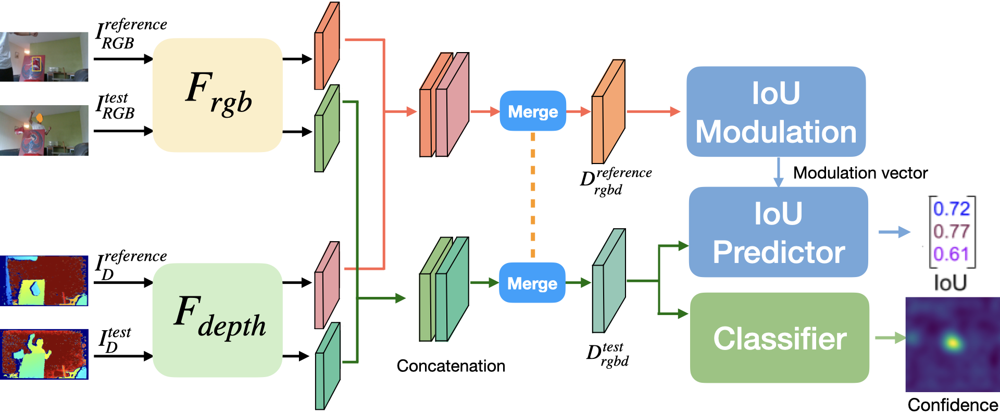

# DeT
Code for the ICCV2021 paper "DepthTrack: Unveiling the Power of RGBD Tracking"

The settings are same as that of Pytracking, please read the document of Pytracking for details.

Dataset will be updated soon.

### Generated Depth
We highly recommend to generate high quality depth data from the existing RGB tracking benchmarks, such as [LaSOT](http://vision.cs.stonybrook.edu/~lasot/), [Got10K](http://got-10k.aitestunion.com/), [TrackingNet](https://tracking-net.org/), and [COCO](https://cocodataset.org/#home).


In our paper, we used the [DenseDepth](https://github.com/ialhashim/DenseDepth) monocular depth estimation method.
We calculate the Ordinal Error (ORD) on the generated depth for CDTB and our DepthTrack test set, and the mean ORD is about 0.386, which is sufficient for training D or RGBD trackers.

```
Alhashim, Ibraheem, and Peter Wonka.
"High quality monocular depth estimation via transfer learning."
arXiv preprint arXiv:1812.11941 (2018).
```

And we also tried the recently [HighResDepth](http://yaksoy.github.io/highresdepth/) from CVPR2020, which also performs very well.
```
Miangoleh, S. Mahdi H., et al.
"Boosting Monocular Depth Estimation Models to High-Resolution via Content-Adaptive Multi-Resolution Merging."
Proceedings of the IEEE/CVF Conference on Computer Vision and Pattern Recognition. 2021.
```

### Architecture
Actually the network architecture is very simple, just adding one ResNet50 feature extractor for Depth input and then merging the RGB and Depth feature maps.





### Download
1) Download the training dataset(70 sequences) of VOT2021RGBD Challenge from Zenodo (DepthTrack RGBD Tracking Benchmark) and edit the path in local.py
More data will be uploaded soon, we hope to bring a large scale RGBD training dataset.
```
http://doi.org/10.5281/zenodo.4716441
```

2) Download the checkpoints for DeT trackers (in install.sh)
```
gdown https://drive.google.com/uc\?id\=1djSx6YIRmuy3WFjt9k9ZfI8q343I7Y75 -O pytracking/networks/DeT_DiMP50_Max.pth
gdown https://drive.google.com/uc\?id\=1JW3NnmFhX3ZnEaS3naUA05UaxFz6DLFW -O pytracking/networks/DeT_DiMP50_Mean.pth
gdown https://drive.google.com/uc\?id\=1wcGJc1Xq_7d-y-1nWh6M7RaBC1AixRTu -O pytracking/networks/DeT_DiMP50_MC.pth
gdown https://drive.google.com/uc\?id\=17IIroLZ0M_ZVuxkGN6pVy4brTpicMrn8 -O pytracking/networks/DeT_DiMP50_DO.pth
gdown https://drive.google.com/uc\?id\=17aaOiQW-zRCCqPePLQ9u1s466qCtk7Lh -O pytracking/networks/DeT_ATOM_Max.pth
gdown https://drive.google.com/uc\?id\=15LqCjNelRx-pOXAwVd1xwiQsirmiSLmK -O pytracking/networks/DeT_ATOM_Mean.pth
gdown https://drive.google.com/uc\?id\=14wyUaG-pOUu4Y2MPzZZ6_vvtCuxjfYPg -O pytracking/networks/DeT_ATOM_MC.pth
```

### Install
```
bash install.sh path-to-anaconda DeT
```

### Train
Using the default DiMP50 or ATOM pretrained checkpoints can reduce the training time.

For example, move the default dimp50.pth into the checkpoints folder and rename as DiMPNet_Det_EP0050.pth.tar

```
python run_training.py bbreg DeT_ATOM_Max
python run_training.py bbreg DeT_ATOM_Mean
python run_training.py bbreg DeT_ATOM_MC

python run_training.py dimp DeT_DiMP50_Max
python run_training.py dimp DeT_DiMP50_Mean
python run_training.py dimp DeT_DiMP50_MC
```

### Test
```
python run_tracker.py atom DeT_ATOM_Max --dataset_name depthtrack --input_dtype rgbcolormap
python run_tracker.py atom DeT_ATOM_Mean --dataset_name depthtrack --input_dtype rgbcolormap
python run_tracker.py atom DeT_ATOM_MC --dataset_name depthtrack --input_dtype rgbcolormap

python run_tracker.py dimp DeT_DiMP50_Max --dataset_name depthtrack --input_dtype rgbcolormap
python run_tracker.py dimp DeT_DiMP50_Mean --dataset_name depthtrack --input_dtype rgbcolormap
python run_tracker.py dimp DeT_DiMP50_MC --dataset_name depthtrack --input_dtype rgbcolormap


python run_tracker.py dimp dimp50 --dataset_name depthtrack --input_dtype color
python run_tracker.py atom default --dataset_name depthtrack --input_dtype color

```
